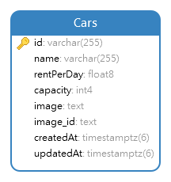
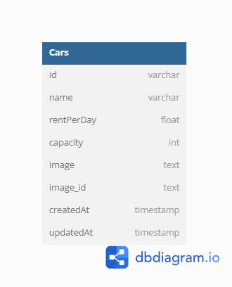

<h1 align="center">
  Chapter 4 - Challenge
</h1>

# Database Diagram

# Postman Docs

<a href="https://documenter.getpostman.com/view/22814931/2sA35EY2XU" target="_blank" title="Postman Documentation"/>

[READ HERE](https://documenter.getpostman.com/view/22814931/2sA35EY2XU)

# Endpoint

### API

| METHOD | End Point        | Deskripsi                        | params                   |
| ------ | ---------------- | -------------------------------- | ------------------------ |
| GET    | /api/v1/cars     | Mendapatkan Semua Data Cars      | [sort, search, capacity] |
| GET    | /api/v1/cars/:id | Mendapatkan Data Car Berdasar ID |                          |
| POST   | /api/v1/cars     | Menambahkan Data Car             |                          |
| PUT    | /api/v1/cars/:id | Me Update Data Car               |                          |
| DEL    | /api/v1/cars/:id | Menghapus Data Car               |                          |
|        |                  |                                  |                          |

### Web Page

| End Point                     | Deskripsi                    | link                                               |
| ----------------------------- | ---------------------------- | -------------------------------------------------- |
| /                             | Halaman HomePage             | http://localhost:2000/                             |
| /cars                         | Halaman Filter Cars (CH OOP) | http://localhost:2000/cars                         |
|                               |                              |                                                    |
| /admin/cars/list-car          | Halaman List Cars Dashboard  | http://localhost:2000/admin/cars/list-car          |
| /admin/cars/list-car/add      | Halaman Tambah Data Car      | http://localhost:2000/admin/cars/list-car/add      |
| /admin/cars/list-car/edit/:id | Halaman Edit Data Car        | http://localhost:2000/admin/cars/list-car/edit/:id |
|                               |                              |                                                    |

# Data Diri

|                  |                          |
| ---------------- | ------------------------ |
| ID Peserta       | **FSW2402KM6024**        |
| Nama Peserta     | **Viery Nugroho**        |
|                  |                          |
| Kelas            | **FSW 1**                |
|                  |                          |
| ID Fasil         | **F-FSW24001086**        |
| Nama Fasilitator | **Imam Taufiq Hermawan** |
|                  |                          |

# Fullstack Web Development

### KM x Binar Academy Batch 6

|                                                       |
| ----------------------------------------------------- |
| **Catatan**                                           |
| Submission Chapter 4 - CRUD Binar Car Rental Database |
